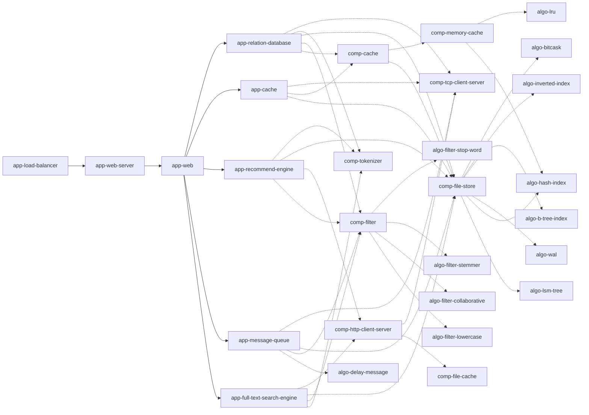

# unnamed

## Description

## Project Structure

1. It based on [project-layout](https://github.com/golang-standards/project-layout)
2. This project use **go work** mode to manage different modules

## Project Architecture

With Jetbrains products,you can search markdown in settings,then install mermaid extension,then you can see the following graph

