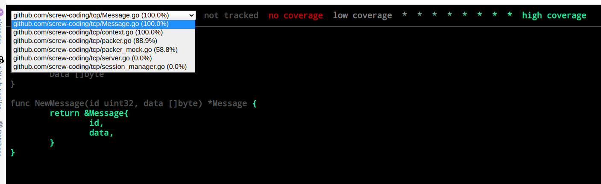
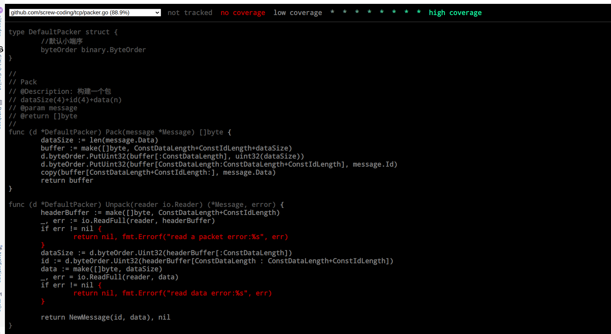

# 单元测试和单元测试代码覆盖率

## 单元测试的目的

单元测试的目的我的理解是，单元测试是一种检查代码的方法，它能够检查代码的编写是否符合要求,并且能够提供一个更好的可测试性.

好的单元测试在代码重构的过程中能够避免漏洞,避免产生一些兼容性错误.

我的开发经验告诉我,如果代码不写单元测试,那么在业务的频繁变动中,很可能添加了新的功能,造成原有的功能不正常,这正是由于没有单元测试通过率的保证,导致原有的逻辑出现变更但是我们人工发现不了.

所谓重复的工作交给机器.

## 单元测试依赖的组件

* github.com/stretchr/testify/assert
* 标准库中的 testing
* github.com/golang/mock/gomock

## 如何开发单元测试

如果用的是Jetbrains旗下的IDE-GoLand,可以很方便的生成单元测试.

比如在RouteContext的类上,按alt+insert,选择Tests for file,就能自动生成一个以_test.go结尾的文件.在其中,只要补充测试用例就可以

如下代码所示

```go

func TestRouteContext_Request(t *testing.T) {
type fields struct {
session     *Session
reqMsg      *Message
responseMsg *Message
}
tests := []struct {
name   string
fields fields
want   *Message
}{
// Add test cases.自己写的代码开始
{name: "test", fields: fields{session: &Session{}, reqMsg: &Message{Id: 1, Data: []byte{1}}}, want: &Message{Id: 1, Data: []byte{1}}},
// Add test cases.自己写的代码结束
}
for _, tt := range tests {
t.Run(tt.name, func (t *testing.T) {
r := RouteContext{
session:     tt.fields.session,
reqMsg:      tt.fields.reqMsg,
responseMsg: tt.fields.responseMsg,
}
assert.Equalf(t, tt.want, r.Request(), "Request()")
})
}
}


```

## 如何执行单元测试

我们继续在pkg/tcp目录下执行命令,跑单元测试

```shell
 go test -cover -v -count=1 -covermode=atomic -coverprofile=coverprofile.cov

```
其中-v是输出测试的过程,-count=1是指只执行一次测试,-covermode=atomic是指覆盖率的计算方式,-coverprofile=coverprofile.cov是指覆盖率的文件输出路径.

得到类似的输出

```shell
--- PASS: TestSession_writeOutbound (0.00s)
PASS
coverage: 32.0% of statements
ok      github.com/screw-coding/tcp     0.006s

```

代表所有的单元测试都PASS了,并且代码覆盖率是32%

## 在浏览器中查看单元测试覆盖率报告

```shell

# 切换到pkg/tcp目录

#跑单元测试,生成覆盖率文件
#在浏览器中查看覆盖率文件
go tool cover -html=coverprofile.cov
```

## 如何根据代码覆盖率进行单元测试的修改

上一节我们已经可以在浏览器中看到单元覆盖率的报告,但是我们还需要根据覆盖率的报告进行单元测试的修改.

其中红色的部分代表单元测试没有执行到,那么我们就需要补充测试代码,让这些遗漏的分支,方法执行到,争取都变成绿色






## 如何解决一些业务代码依赖其他中间件的问题

有如下场景,业务代码依赖其他中间件,比如redis,mysql,rabbitmq,这些中间件我们不希望进行单元测试,因为不是我们的业务逻辑

但是,在开发或者发布过程中,我们可能会发现,不能连接这些中间件,这时候就需要使用mock来替代这些中间件.

全局安装mockgen

```bash
go install github.com/golang/mock/mockgen@v1.6.0
```

在项目里引入gomock包

```shell
cd /pkg/tcp
go get -u github.com/golang/mock/gomock
```

生成mock文件

```shell
mockgen -source=packer.go -destination=packer_mock.go -package=server
```

上述代码执行之后就生成了packer_mock.go文件,这个文件里面就是mock的代码.

接下来,我们可以新建一个packer_test.go文件,以mock的方式进行测试

```go

package server

import (
	"bytes"
	"github.com/golang/mock/gomock"
	"github.com/stretchr/testify/assert"
	"log"
	"testing"
)

func Test_pack_unpack(t *testing.T) {
	t.Run("when everything's fine", func(t *testing.T) {
		packer := NewDefaultPacker()
		msg := NewMessage(1, []byte{1, 2, 3})
		data := packer.Pack(msg)
		buffer := bytes.NewBuffer(data)
		msg2, err := packer.Unpack(buffer)
		assert.NoError(t, err)
		assert.Equal(t, msg, msg2)
	})
}

func Test_mock_packer(t *testing.T) {
	t.Run("when everything's fine", func(t *testing.T) {
		ctl := gomock.NewController(t)
		mockPacker := NewMockPacker(ctl)
		mockPacker.EXPECT().Pack(gomock.Any()).Return([]byte{1, 2, 3}).AnyTimes()
		pack := mockPacker.Pack(&Message{Id: 1, Data: []byte{1}})
		log.Println(pack)
	})
}

```


