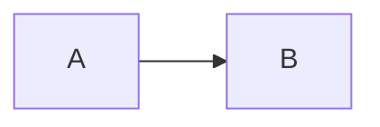

# TCP客户端和服务端

## 技术栈

* 完全使用go的标准库实现,无三方依赖

## 技术细节

### 异步IO实现

1. 使用一个SessionManager管理所有的Session
2. 使用协程处理每个客户端发来的数据
3. 每个Session使用一个channel去存放准备异步发送给客户端的数据
4. 当客户端发来数据时，将数据放入Session的channel中，然后异步发送给客户端

流程图TBD

## 功能实现
- [x] 发送与接收消息
- [ ] 默认的打包器和解包器
- [ ] TLS支持
- [ ] 自定义打包器格式
- [ ] protobuf支持